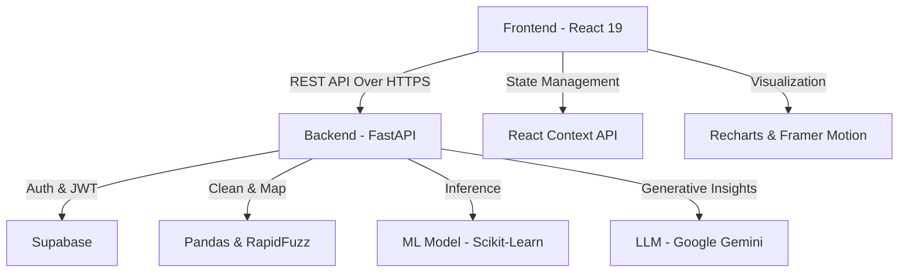

# Project Report: RiskLens
**AI-POWERED STUDENT RISK ASSESSMENT PLATFORM**

---

## 📖 Introduction
**RiskLens** (Early Detection, Better Outcomes) is a professional academic analytics platform designed to proactively identify students at risk of poor academic performance. It bridges the gap between raw student data and actionable intervention strategies using advanced data science and generative AI.

---

## 🔄 Step-by-Step Project Workflow

The following section breaks down the logical flow of the application from user entry to final AI-driven outcomes.

### 1. Secure Authentication & Role Assignment
*   **Action**: Users (Teachers or Students) sign up or sign in using their institutional email.
*   **Behind the Scenes**: Supabase handles the authentication and retrieves user profiles. Based on the `role` field in the database, the application routes the user to either the **Teacher Dashboard** or the **Student Dashboard**.

### 2. Multi-Channel Data Ingestion
*   **Teacher Flow**: The teacher uploads a CSV file containing records for dozens or hundreds of students. These records include metrics like study hours, attendance, and exam scores.
*   **Student Flow**: A student manually enters their current study habits and performance metrics into a simple, intuitive form.

### 3. Automated Data Alignment (Fuzzy Column Matching)
*   **The Problem**: CSV files often have different column headers (e.g., "Hours_Studied" vs. "Study Time").
*   **The Solution**: RiskLens uses a **Fuzzy Matching algorithm** (powered by RapidFuzz) to automatically detect and map these varying headers to the standard internal data model. This eliminates the need for manual data cleaning by the teacher.

### 4. Machine Learning Inference (The Predictor)
*   **Process**: Once the data is aligned, it is fed into a **Scikit-Learn pipeline**.
*   **Outcome**: The model calculates two key values for every student:
    *   **Risk Classification**: (Low Risk vs. High Risk)
    *   **Risk Probability**: (A percentage score, e.g., "85% High Risk")
*   **Metrics Analyzed**: Study hours, mid-sem marks, previous semester performance, attendance, and digital screen time.

### 5. Generative AI Insight Generation (Google Gemini)
*   **The "So What?" Factor**: Raw numbers or a "High Risk" label aren't enough for effective intervention.
*   **The Action**: The system sends the identified risk patterns to **Google Gemini AI**.
*   **The Result**: The AI analyzes the data and generates a detailed report summarizing why certain students are at risk and proposing 3-4 specific educational interventions (e.g., "Student A needs a 15% reduction in screen time to improve study focus").

### 6. Interactive Visualized Outcomes
*   **Action**: Outcomes are displayed to the user.
*   **Teachers** see a comprehensive dashboard with risk distribution charts, top-risk student tables, and full-class performance summaries.
*   **Students** see a personalized "Risk Gauge" with encouraging, AI-generated tips tailored specifically to their data.

---

## 🏗 Project Architecture

RiskLens follows a modern, decoupled architecture designed for performance and scalability.

### Component Breakdown:
1.  **Client-Side (React 19)**: A high-performance Single Page Application (SPA) that manages user state, handles CSV uploads, and renders dynamic visualizations using **Recharts** and **Framer Motion**.
2.  **Server-Side (FastAPI)**: A lightweight, asynchronous Python API that coordinates data flow between the ML models and the database.
3.  **Data & Auth Layer (Supabase)**: Provides enterprise-grade authentication and secure storage for user metadata and department settings.
4.  **Intelligence Layer (ML & AI)**: 
    *   **ML Predictor**: A serialized Scikit-learn model that performs high-speed classification.
    *   **Gemini 1.5 Flash**: Orchestrates the generative logic to provide human-readable, actionable reports.
5.  **Analytics Layer (Pandas)**: Performs high-speed data manipulation to ensure smooth handling of large datasets (e.g., 10,000+ student records).
